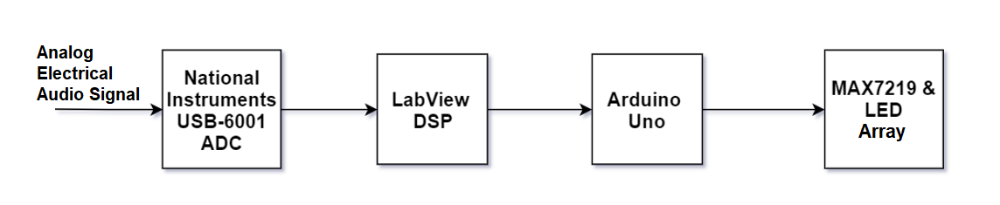

# 8-Band Spectral Analyzer using Arduino & LabVIEW
This is a small project I developed in 2019, during my studies in Electrical & Computer Engineering @ University of Patras. 

It uses components in order to digitize an analog signal, process it using *LabVIEW* (unfortunately required to use for my class), and then output it to an *Arduino Uno*, which then controls an LED 8x8 array in order to display the spectrogram of the input audio signal.   

The general architecture of the system is shown below:

In summary:
- The NI USB-6001 Analog-to-Digital Converter is used to digitize the analog electrical signal
- The digitized signal is then processed in a PC using LabVIEW.
    - The DC component is filtered out.
    - Calculates the signal's spectrum using Fast Fourier Transform.
    - Quantizes the spectrum into **8 integers** representing the maximum component detected in each of 8 different equal ranges (frequencies 0-fs/2).
    - Sends those 8 intergers to an *Arduino Uno* **using the serial port**.
- The Arduino then **displays the quantized spectrum** in a 8x8 LED Array using the MAX7219 shift register and the LedControl library.

The project report (written in modern Greek) can be found [here](misc/Report.pdf). It contains all the necessary information about connections and explains the spectrum quantization logic in detail.

The Arduino half of the system can be tested using a simple .wav file, fed through LabVIEW. I have provided 2 audio files I used while testing the system in the [test_wavs](test_wavs) folder.

**NOTE:** The input analog signal should be properly filtered using an analog Low Pass Filter, in order to avoid aliasing. 